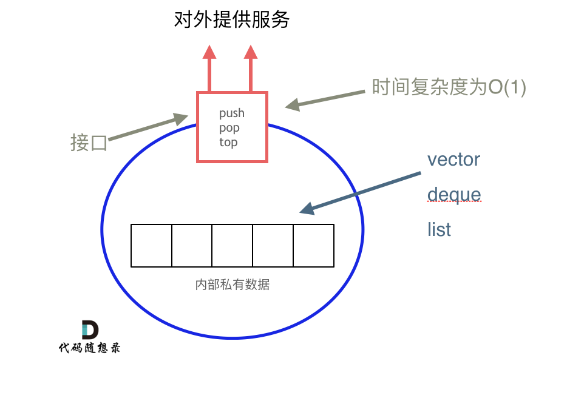

用栈实现队列：

push() -- 将一个元素放入队列的尾部。
pop() -- 从队列首部移除元素。
peek() -- 返回队列首部的元素。只是查看
empty() -- 返回队列是否为空。

Myqueue queue = new.queue();
queue.push(1);
queue.push(2);
queue.peek(1)；
queue.pop(1)；
queue.empty();

以上代码运行过程如下：
首先分别push1和2，
然后peek查看队列首个元素，因为队列为fifo，所以首个元素是1，那么此时return数值为1
然后pop出队列首元素，则为1，
然后empty()判断是否为空队列，然后返回false，因为队列中还存在element2

!!!!
理论基础
栈stack提供pop和push等接口，所有元素elements必须符合先进先出的规则要求，所以🚉是不可以提供迭代器等
栈stack并不是容器，而是容器适配器container adapter，所以栈是以底层容器完成所有的工作对外提供统一的接口，底层容器是可以插拔的，也就是说就恶意控制使用何种容器来实现栈的功能
栈stack的底层实现可以是vector，deque或者list都可以

