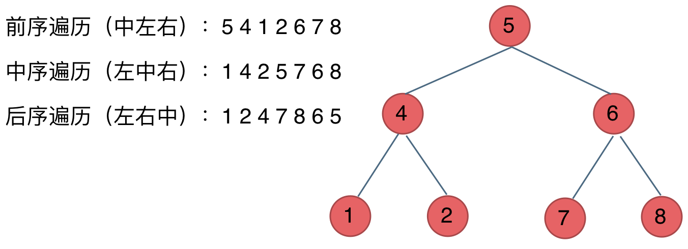
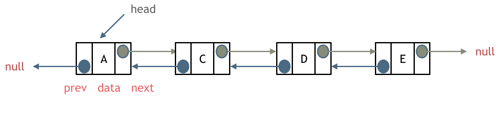
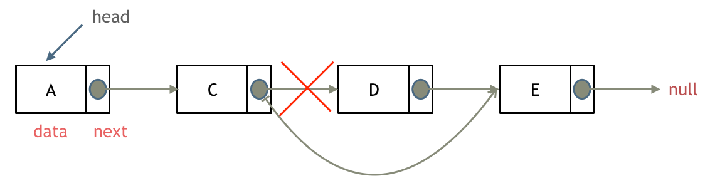
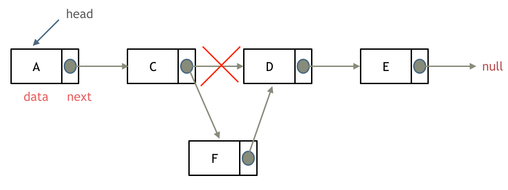

链表概念：
    链表是一个有指针组成的数据结构，首先链表有两个部分，第一个部分是数据域（作用是存储数据），第二个部分是指针域（存储指向下一个区域的指针），链表的末尾指向NULL（空指针）
    链表的入口指针成为链表的头指针head
    

链表的类型：
1)单链表：只有一个指针，指针域只能指向下一个节点
2)双链表：有两个指针，指针域分别指向上一个节点和下一个节点，所以双链表既可以向前查询也可以向后查询
3)循环链表：链表首位相连

链表存储方式：
数组array在内存中是连续分布的，而链表linked-list是通过指针相连

链表的定义：

C/C++的定义链表节点方式(构造函数的方式)
//单链表
Struct listnode{
    int val;  //节点上存储的元素
    listnode *next;  //指向下一个节点的指针
    listnode(int n): val(x), next(NULL);  //节点的构造函数
}

链表操作：
删除节点deleated_node

增加节点add_node

time complexity:

                     插入/删除元素       查询元素
数组array：             O(n)             O(1)

链表linkedlist：        O(1)             O(n)

因为在数组中，插入和删除元素需要移动后续的elements，所以时间复杂度为O(n)
而查询元素则找到head节点即可

在链表中，插入和删除元素可以找到对应位置删除指针或插入即可，所以时间复杂度为O(1)
而查询元素则需要遍历链表

数组删除的代码：
设置一个虚拟头结点在进行移除节点操作
class Solution {
public:
    ListNode* removeElements(ListNode* head, int val) {
        ListNode *dummy = new ListNode();
        dummy->next = head;
        ListNode *cur = dummy;
        while(cur!=NULL&&cur ->next != nullptr){
            if(cur->next->val == val){
                cur->next = cur->next->next;
            }
            else(cur = cur->next);
        }

        ListNode* newHead = dummy->next;  // Save new head before deleting dummy
        delete dummy;  // Delete dummy to prevent memory leak
        return newHead;  // Return the correct head of the list
    }
};

使用虚拟节点是因为可以统一delate_firstnode和delate_node两种类型

首先将虚拟节点实例化，创建一个*dummy指针，作用在ListNode处
因为位于head之前，所以最开始的时候应该ListNode->next = head
创建一个current指针，因为头节点不断在变化所以需要新建一个虚拟节点遍历链表
ListNode *cur = dummy;
因为要不断的判断，所以使用while loop，当cur指针不为空指针然后下一位也不为空的时候，因为删除节点是将该元素的上一个节点的指针指向下一个节点的数值域，所以if下一个所对应的数值为所寻找的val则直接指向下一个，否则就继续遍历后续节点