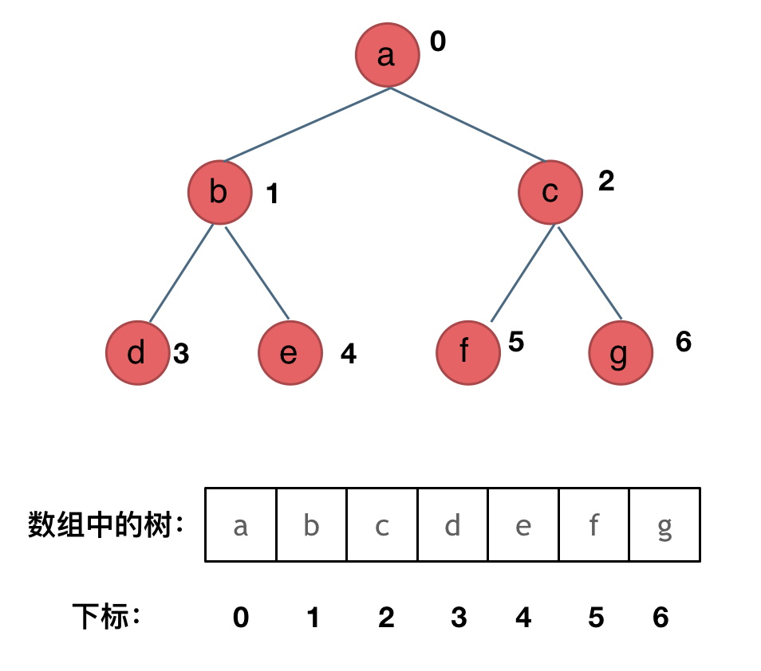

977.有序数组的平方
给你一个按 非递减顺序 排序的整数数组 nums，返回 每个数字的平方 组成的新数组，要求也按 非递减顺序 排序。

示例 1：

输入：nums = [-4,-1,0,3,10]
输出：[0,1,9,16,100]
解释：平方后，数组变为 [16,1,0,9,100]，排序后，数组变为 [0,1,9,16,100]
示例 2：

输入：nums = [-7,-3,2,3,11]
输出：[4,9,9,49,121]

数组其实是有序的， 只不过负数平方之后可能成为最大数了。
那么数组平方的最大值就在数组的两端，不是最左边就是最右边，不可能是中间。
此时可以考虑双指针法了，i指向起始位置，j指向终止位置。

class Solution {
public:
    vector<int> sortedSquares(vector<int>& nums) {
        for(int readindex = 0;readindex < nums.size();readindex++){
            nums[readindex] = nums[readindex] * nums[readindex];
        }
        sort(nums.begin(),nums.end());
        //应该等所有index都平方后再sort，所以应该放在for loop外//
    return nums;
    }
};    

209.长度最小的子数组 minnimal size subarray sum
Given an array of positive integers nums and a positive integer target, return the minimal length of a 
subarray
 whose sum is greater than or equal to target. If there is no such subarray, return 0 instead.

Input: target = 7, nums = [2,3,1,2,4,3]
Output: 2
Explanation: The subarray [4,3] has the minimal length under the problem constraint.
Example 2:

Input: target = 4, nums = [1,4,4]
Output: 1
Example 3:

Input: target = 11, nums = [1,1,1,1,1,1,1,1]
Output: 0

使用滑动窗口的方式来完成，滑动窗口就是不断调整窗口的大小来找到最小长度的窗口
其实也可以理解为双指针的一种：
窗口内是什么？
窗口内应为最小长度的连续array

如何移动窗口的起始位置？
首先移动end指针，sum += nums[end],sum > target的时候，则移动起始位置也就是缩小窗口
如何移动窗口的结束位置？
遍历数组的指针，也就是for循环里的索引

#include <vector>
#include <limits>
class Solution {
public:
    int minSubArrayLen(int target, vector<int>& nums) {
        int start = 0;
        int sum = 0;// 计算累加总和//
        int minlength = INT_MAX;
        for(int end = 0;end < nums.size();end++){
            sum += nums[end];
            while(sum >= target){
                sum -= nums[start];
                minlength = min(minlength,end - start +1);
                start ++;
            }
        }
        return minlength == INT_MAX ? 0 : minlength;
    }
};

59.螺旋矩阵

class Solution {
public:
    vector<vector<int>> generateMatrix(int n) {
       vector<vector<int>> res(n, vector<int>(n, 0));
        int startx = 0,starty = 0;
        int loop = n/2;
        int offset = 1;
        int i,j = 0;
        int count = 1;
        int mid = (n/2);
        while(loop--){
            int i = startx;
            int j = starty;
            for(j;j<n-offset;j++){
                res[i][j] = count++;
            }
            for(i;i<n-offset;i++){
                res[i][j] = count++;
            }
            for(;j> starty;j--){
                res[i][j] = count++;
            }
            for(;i>startx;i--){
                res[i][j] = count++;
            }
            startx += 1;
            starty += 1;
            offset += 1;
        }
        if(n%2 == 1){
            res[mid][mid] = (count);
            }
        return res;
    }
};