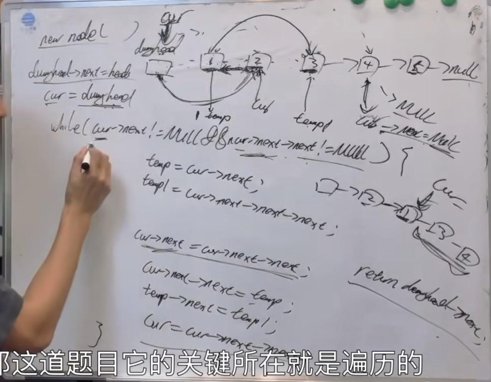
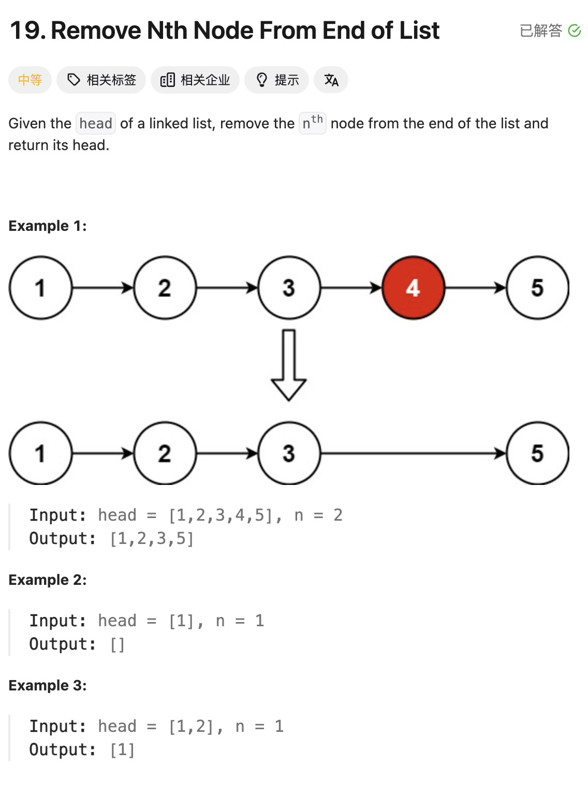

1.首先创建虚拟头节点dummyhead，和cur节点负责遍历
2.因为操作该节点的情况，必须是移动至该节点的前一个节点才可以
3.while loop（当cur的下一个和下下个节点都不为NULL时）执行操作
因为读取节点的时候，其实是要链接到数据域，但是因为反转链表需要断开节点，所以需要提前保存两个断开节点的node
4.如上图所示：首先使用temp等于=的头节点，然后temp1=3节点
5.然后开始反转：首先cur指向2node
此时一定要切记该时的链表已经改变，2node指向1node，然后1node指向3
6.完成后要改变cur指针向后移动
7.返回的应该是dummyhead的下一位，即虚拟指针的下一位才为真正头指针也就是链表

ListNode *dummyhead = new ListNode(0);
dummyhead->next = head;
ListNode *cur = dummyhead;
while(cur->next ! = null && cur->next->next != NULL){
    ListNode *temp = cur->next;
    ListNode *temp1 = cur->next->next->next;
    cur->next = cur->next->next;
    cur->next = temp;
    cur->next->next = temp1;
    cur = cur->next->next
}
    ListNode* result = dummyHead->next;
    delete dummyHead;
    return result;

19.删除链表的倒数第N个节点 

以下为代码：
/**
 * Definition for singly-linked list.
 * struct ListNode {
 *     int val;
 *     ListNode *next;
 *     ListNode() : val(0), next(nullptr) {}
 *     ListNode(int x) : val(x), next(nullptr) {}
 *     ListNode(int x, ListNode *next) : val(x), next(next) {}
 * };
 */
class Solution {
public:
    ListNode* removeNthFromEnd(ListNode* head, int n) {
        ListNode *dummyhead = new ListNode();
        dummyhead->next = head;
        ListNode *fastindex = dummyhead;
        ListNode *slowindex = dummyhead;
        while(n-- && fastindex != NULL){
            fastindex = fastindex->next;
        }
        fastindex = fastindex->next;
//多走一步，这样当fast和slow同时移动的时候，slow才能停在所要删除的index前面
        while(fastindex != NULL){
            fastindex = fastindex->next;
            slowindex = slowindex->next;
        }
        slowindex->next = slowindex->next->next;
    return dummyhead->next;
    }
};

