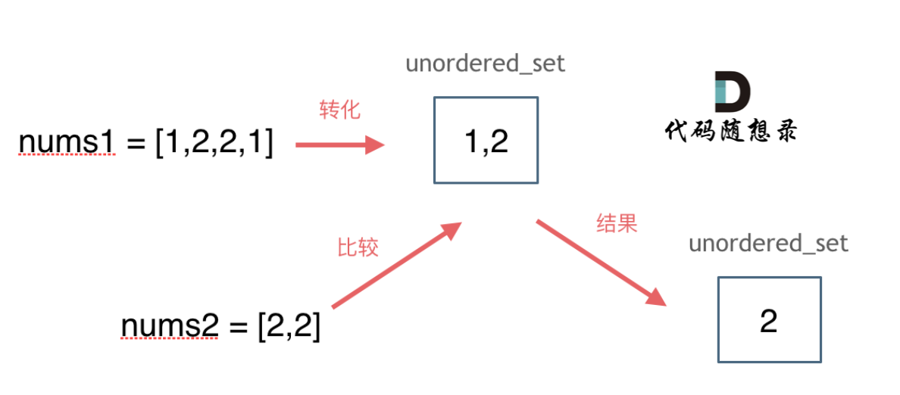

hash table
哈希表其实就是数组，哈希表中的关键字就是数组的index索引下标

！！！！！！哈希表的作用一般是判断一个元素是否出现在集合内！！！！！！
做法：一般是将该元素映射到哈希表上的索引，然后通过查询索引下标快速知道该元素是否在集合内

使用hash table解决问题的时候一般会有三种数据结构：
array数组：数值较小的时候
set集合：数值较大或者数值分布很散
map映射

242.valid anagram

Given two strings s and t, return true if t is an anagram of s, and false otherwise.

An Anagram is a word or phrase formed by rearranging the letters of a different word or phrase, typically using all the original letters exactly once.

Example 1:

Input: s = "anagram", t = "nagaram"
Output: true
Example 2:

Input: s = "rat", t = "car"
Output: false
 
以下为代码：
class Solution {
public:
    bool isAnagram(string s, string t) {
        int hash[26] = {0};
        for(int i = 0;i<s.size();i++){
            hash[s[i] - 'a'] ++; 
        }
        for(int j = 0;j<t.size();j++){
            hash[t[j] - 'a'] --;
        }
        for(int n = 0;n<26;n++){
            if(hash[n] != 0){
                return false;
            }
        }
    return true;
    }
};
对比两个字符串是否存在异位，一般查询一个元素是否存在集合内都考虑使用hashtable
首先初始化一个hashtable = {0}；
然后将每个元素都减去'a'，我们只需要得到相对的索引数值即可，不需要知道具体字母的编码值
其次将该数组拿过来继续遍历一遍，如果在t中出现元素那么就减减
所以如果出现相同元素那么应该为0，
若结果为positive num那么就是s有t无
若结果为nativity num那么就是s无t有

349.intersection of two arrays
Given two integer arrays nums1 and nums2, return an array of their 
intersection
. Each element in the result must be unique and you may return the result in any order.

Example 1:

Input: nums1 = [1,2,2,1], nums2 = [2,2]
Output: [2]
Example 2:

Input: nums1 = [4,9,5], nums2 = [9,4,9,8,4]
Output: [9,4]
Explanation: [4,9] is also accepted.
 
以下为代码：
class Solution {
public:
    vector<int> intersection(vector<int>& nums1, vector<int>& nums2) {
        unordered_set<int> result_set; // 存放结果，用于去重
        unordered_set<int> nums_set(nums1.begin(), nums1.end()); // 将 nums1 的元素放入哈希表

        // 遍历 nums2，检查元素是否存在于 nums1 的集合中
        for (int i = 0; i < nums2.size(); i++) {
            if (nums_set.find(nums2[i]) != nums_set.end()) {
                result_set.insert(nums2[i]); // 如果存在，添加到结果集
            }
        }
        return vector<int>(result_set.begin(), result_set.end()); // 将结果集转换为 vector 并返回
    }
};

