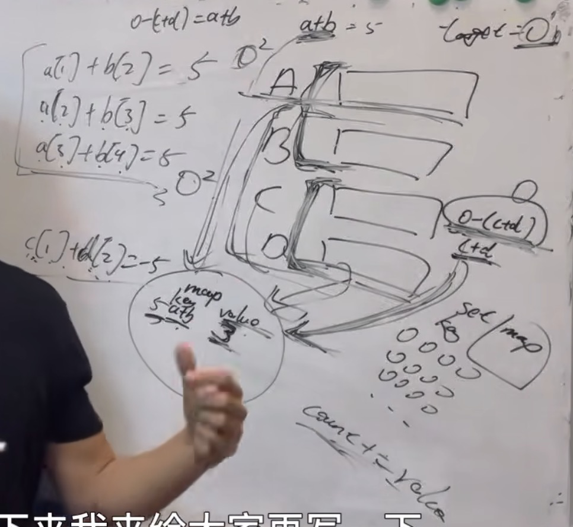

以下为代码：
#include <vector>
#include <unordered_map>

using namespace std;

class Solution {
public:
    int fourSumCount(vector<int>& A, vector<int>& B, vector<int>& C, vector<int>& D) {
        unordered_map<int, int> map; //key:a+b的数值，value:a+b数值出现的次数
        // 遍历大A和大B数组，统计两个数组元素之和，和出现的次数，放到map中
        for (int a : A) {
            for (int b : B) {
                map[a + b]++;
            }
        }
        int count = 0; // 统计a+b+c+d = 0 出现的次数
        // 再遍历大C和大D数组，找到如果 0-(c+d) 在map中出现过的话，就把map中key对应的value也就是出现次数统计出来。
        for (int c : C) {
            for (int d : D) {
                int target = 0 - (c + d);
                if (map.find(target) != map.end()) {
                    count += map[target];
                }
            }
        }
        return count;
    }
};
