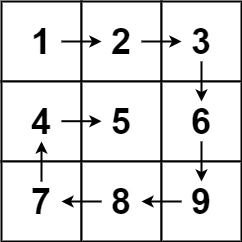

代码随想录算法训练营第一天| 704. 二分查找、27. 移除元素

leetcode207二分查找

第一种写法，定义 target 是在一个在左闭右闭的区间里，也就是[left, right] 

区间的定义这就决定了二分法的代码应该如何写，因为定义target在[left, right]区间，所以有如下两点：

while (left <= right) 要使用 <= ，因为left == right是有意义的，所以使用 <=
可以是[1，1]来举例说明，因为左边和右边都包含1，所以可能left = right，即1=1
if (nums[middle] > target) right 要赋值为 middle - 1，因为当前这个nums[middle]一定不是target，
！！！要一直坚持左闭右闭的原则，以为已经确定nums[middle]是大于target，那么就应该选择下一位（middle-1）
那么接下来要查找的左区间结束下标位置就是 middle - 1
例如在数组：1,2,3,4,7,9,10中查找元素2，如图所示：
```
class solution{
public:
    int search(vector<int>& nums, int target){
        int left = 0;
        int right = num.size() - 1;
        while(left<=right){
            int middle = left + ((right - left) / 2);
            if(nums[middle] > target){
                right = middle - 1;
            }
            else if(num[middle] < target){
                left = middle + 1;
            }
            else{
<!-- (num[middle] = target); -->
            return middle;
            }
        return 0;
        }
    }
};
```

1.	表达式的重构：
	•	考虑到溢出发生在 left + right 的时候，如果 left 和 right 都是接近 INT_MAX 的大数，那么相加的结果可能会超出 int 的表示范围。
	•	改为 left + (right - left) / 2 后，首先计算 (right - left) / 2。由于 right 和 left 都是非负数，right - left 结果不会超过 right，因此 (right - left) / 2 也不会很大。
	2.	重构的数学等价性：
	•	通过数学公式的等价性，可以证明 left + (right - left) / 2 和 (left + right) / 2 计算结果是相同的。
	•	(left + right) / 2 可以拆分成 left + (right - left) / 2 这一形式。


#二分法第二种写法
如果说定义 target 是在一个在左闭右开的区间里，也就是[left, right] ，那么二分法的边界处理方式则截然不同。
有如下两点：

while (left < right)，这里使用 < ,因为left == right在区间[left, right]是没有意义的
依然可以是(1，1)来举例说明，因为左边已经包含1，但是右边不包含1，所以不可能left = right
if (nums[middle] > target) right 更新为 middle，因为当前nums[middle]不等于target，去左区间继续寻找，而寻找区间是左闭右开区间，所以right更新为middle，即：下一个查询区间不会去比较nums[middle]
在数组：1,2,3,4,7,9,10中查找元素2，如图所示：（注意和方法一的区别）
]
class solution{
public:
    int search(vector<int>& nums, int target){
        int left;
        int right = nums.size() - 1;
        while(left < right){
            int middle = left + ((right - left)+1);
            if(nums[middle] > target){
                right = middle
            }
            else if(nums[middle] < target){
                left = middle - 1;
            }
            else{
                return middle;
            }
        return 0;
        }
    }
}


分析 int search(vector<int>& nums, int target)

	1.	返回类型 (int):
	•	int 是函数的返回类型，这意味着函数在完成其任务后会返回一个整数值。在这个具体的例子中，search 函数返回一个整数，该整数代表目标值在数组中的索引。如果目标值不在数组中，通常会返回 -1。
	2.	函数名 (search):
	•	search 是函数的名称。函数名用于标识和调用函数。在调用这个函数时，你会使用 search 这个名称。
	3.	参数列表 (vector<int>& nums, int target):
	•	参数列表指定了函数可以接受的输入。这个函数有两个参数：
	1.	vector<int>& nums:
	•	vector<int> 是标准库中的一个模板类，表示一个整数的动态数组。& 符号表示该参数是一个引用。通过引用传递可以避免复制整个向量，提高效率，尤其是当向量很大时。
	•	nums 是参数的名称。它表示你传递给函数的整数向量。
	2.	int target:
	•	int 表示参数是一个整数。
	•	target 是参数的名称，表示你要在向量中查找的目标值。


27.Remove Element：
Given an integer array nums and an integer val, remove all occurrences of val in nums in-place. The order of the elements may be changed. Then return the number of elements in nums which are not equal to val.

Consider the number of elements in nums which are not equal to val be k, to get accepted, you need to do the following things:

Change the array nums such that the first k elements of nums contain the elements which are not equal to val. The remaining elements of nums are not important as well as the size of nums.

Example 1:
Input: nums = [3,2,2,3], val = 3
Output: 2, nums = [2,2,_,_]
Explanation: Your function should return k = 2, with the first two elements of nums being 2.
It does not matter what you leave beyond the returned k (hence they are underscores).

Example 2:
Input: nums = [0,1,2,2,3,0,4,2], val = 2
Output: 5, nums = [0,1,4,0,3,_,_,_]
Explanation: Your function should return k = 5, with the first five elements of nums containing 0, 0, 1, 3, and 4.
Note that the five elements can be returned in any order.
It does not matter what you leave beyond the returned k (hence they are underscores).

第二种方法：双指针
双指针法（快慢指针法）： 通过一个快指针和慢指针在一个for循环下完成两个for循环的工作。

定义快慢指针

快指针：寻找新数组的元素 ，新数组就是不含有目标元素的数组
慢指针：指向更新 新数组下标的位置

// 时间复杂度：O(n)
// 空间复杂度：O(1)
cpp
```cpp
class Solution {
public:
    int removeElement(vector<int>& nums, int val) {
        int write = 0;
        for(int read = 0;read<nums.size();read++){
            if(nums[read] != val){
                nums[write++] = nums[read];
            }
        }
        return write;
    }
};
```

py
```py
class Solution:
    def removeElement(self, nums: List[int], val: int) -> int:
        write = 0
        for read in nums:
            if read != val:
                nums[write] = read
                write+=1
        return write

```

69. Sqrt(x)
Given a non-negative integer x, return the square root of x rounded down to the nearest integer. The returned integer should be non-negative as well.

You must not use any built-in exponent function or operator.

For example, do not use pow(x, 0.5) in c++ or x ** 0.5 in python.
 

Example 1:
Input: x = 4
Output: 2
Explanation: The square root of 4 is 2, so we return 2.

Example 2:
Input: x = 8
Output: 2
Explanation: The square root of 8 is 2.82842..., and since we round it down to the nearest integer, 2 is returned.
cpp
```cpp
class Solution {
public:
    int mySqrt(int x) {
        int left = 0;
        int right = x;
        while(left<=right){
            long long mid = left+(right-left)/2;
            if((mid*mid)>x){
                right = mid-1;
            }
            else if((mid*mid)<x){
                left = mid+1;
            }
            else{
                return mid;
            }
        }
        return right;
    }
};
```
py
```py
class Solution:
    def mySqrt(self, x: int) -> int:
        left,right = 0,x
        while(left<=right):
            mid = left+(right - left)//2
            if(mid*mid>x):
                right = mid-1
            elif(mid*mid<x):
                left = mid+1
            else:
                return mid
        return right

```

367. Valid Perfect Square
Given a positive integer num, return true if num is a perfect square or false otherwise.

A perfect square is an integer that is the square of an integer. In other words, it is the product of some integer with itself.

You must not use any built-in library function, such as sqrt.

Example 1:
Input: num = 16
Output: true
Explanation: We return true because 4 * 4 = 16 and 4 is an integer.

Example 2:
Input: num = 14
Output: false
Explanation: We return false because 3.742 * 3.742 = 14 and 3.742 is not an integer.

```cpp
class Solution {
public:
    bool isPerfectSquare(int num) {
        int left = 0; 
        int right = num;
        while (left <= right) {
            long long mid = left + (right - left) / 2;
            if ((mid*mid) > num) {
                right = mid - 1;
            } else if ((mid*mid) < num) {
                left = mid + 1;
            } else {
                return true;
            }
        }
        return false;
    }
};
```
py
```py
class Solution:
    def isPerfectSquare(self, num: int) -> bool:
        left,right = 0,num
        while(left<=right):
            mid = left+(right-left)//2
            if((mid*mid)>num):
                right = mid-1
            elif((mid*mid)<num):
                left = mid+1
            else:
                return True
        return False
```

1.  Search Insert Position
Given a sorted array of distinct integers and a target value, return the index if the target is found. If not, return the index where it would be if it were inserted in order.

You must write an algorithm with O(log n) runtime complexity.

Example 1:
Input: nums = [1,3,5,6], target = 5
Output: 2

Example 2:
Input: nums = [1,3,5,6], target = 2
Output: 1

Example 3:
Input: nums = [1,3,5,6], target = 7
Output: 4
py
```py
class Solution:
    def searchInsert(self, nums: List[int], target: int) -> int:
        left,right = 0,len(nums)-1
        while(left<=right):
            mid = left+(right-left)//2
            if(nums[mid]>target):
                right = mid-1
            elif(nums[mid]<target):
                left = mid+1
            else:
                return mid
        nums.insert(left,target)
        return left
```

26.  Remove Duplicates from Sorted Array

Given an integer array nums sorted in non-decreasing order, remove the duplicates in-place such that each unique element appears only once. The relative order of the elements should be kept the same. Then return the number of unique elements in nums.

Consider the number of unique elements of nums to be k, to get accepted, you need to do the following things:

Change the array nums such that the first k elements of nums contain the unique elements in the order they were present in nums initially. The remaining elements of nums are not important as well as the size of nums.
Return k.

Example 1:
Input: nums = [1,1,2]
Output: 2, nums = [1,2,_]
Explanation: Your function should return k = 2, with the first two elements of nums being 1 and 2 respectively.
It does not matter what you leave beyond the returned k (hence they are underscores).

Example 2:
Input: nums = [0,0,1,1,1,2,2,3,3,4]
Output: 5, nums = [0,1,2,3,4,_,_,_,_,_]
Explanation: Your function should return k = 5, with the first five elements of nums being 0, 1, 2, 3, and 4 respectively.
It does not matter what you leave beyond the returned k (hence they are underscores).
```cpp
class Solution {
public:
    int removeDuplicates(vector<int>& nums) {
        int write = 1;
        nums[read-1] 
        // without first checking if read is zero. This results in undefined behavior because nums[read-1] tries to access memory before the start of the nums array when read is zero.
        for(int read = 1;read<nums.size();read++){
            if(nums[read]!=nums[read-1]){
                nums[write++] = nums[read];
            }
        }
        return write;
    }
};
```
py
```py
class Solution:
    def removeDuplicates(self, nums: List[int]) -> int:
        write = 1
        for read in range(1,len(nums)):
            if(nums[read]!=nums[read-1]):
                nums[write] = nums[read]
                write+=1
        return write
```


283. Move Zeroes
Given an integer array nums, move all 0's to the end of it while maintaining the relative order of the non-zero elements.

Note that you must do this in-place without making a copy of the array.

Example 1:
Input: nums = [0,1,0,3,12]
Output: [1,3,12,0,0]

Example 2:
Input: nums = [0]
Output: [0]
cpp
```cpp
class Solution {
public:
    void moveZeroes(vector<int>& nums) {
        int write = 0;
        for(int read = 0;read<nums.size();read++){
            if(nums[read]!=0){
                nums[write++] = nums[read];
            }
        }
        \*
        this for loop should arrange outside the last for loop
        \*
        for(int i = write;i<nums.size();i++){
            nums[i] = 0;
        }
    }
};
```
py
```py
class Solution:
    def moveZeroes(self, nums: List[int]) -> None:
        write = 0
        # for read in nums: In Python, when using for read in nums, read will be the actual value of the element in the list, not its index.
        for read in range(len(nums)):
            if(nums[read]!=0):
                nums[write] = nums[read]
                write+=1
        for i in range(write,len(nums)):
            nums[i] = 0
        """
        Do not return anything, modify nums in-place instead.
        """
```

844. Backspace String Compare
Given two strings s and t, return true if they are equal when both are typed into empty text editors. '#' means a backspace character.

Note that after backspacing an empty text, the text will continue empty.

Example 1:
Input: s = "ab#c", t = "ad#c"
Output: true
Explanation: Both s and t become "ac".

Example 2:
Input: s = "ab##", t = "c#d#"
Output: true
Explanation: Both s and t become "".

Example 3:
Input: s = "a#c", t = "b"
Output: false
Explanation: s becomes "c" while t becomes "b".
```cpp
class Solution {
public:
    bool backspaceCompare(string s, string t) {
        return build(s) == build(t);
    }
    string build(string str){
        string ret;
        for(char ch:str){
            if(ch != '#'){
                ret.push_back(ch);
            }
            else if(ret.size() != 0){
                ret.pop_back();
            }
        }
    return ret;
    }
};
```


977. Squares of a Sorted Array
Given an integer array nums sorted in non-decreasing order, return an array of the squares of each number sorted in non-decreasing order.

Example 1:
Input: nums = [-4,-1,0,3,10]
Output: [0,1,9,16,100]
Explanation: After squaring, the array becomes [16,1,0,9,100].
After sorting, it becomes [0,1,9,16,100].

Example 2:
Input: nums = [-7,-3,2,3,11]
Output: [4,9,9,49,121]

cpp
```cpp
class Solution {
public:
    vector<int> sortedSquares(vector<int>& nums) {
        int write = 0;
        for(int read = 0;read < nums.size();read++){
            nums[write++] = nums[read]*nums[read];
        }
        sort(nums.begin(),nums.end());
        return nums;
    }
};
```

py
```py
class Solution:
    def sortedSquares(self, nums: List[int]) -> List[int]:
        write = 0
        for read in range(len(nums)):
            nums[write] = nums[read]*nums[read]
            write+=1
        result = sorted(nums)
        return result
```

209. Minimum Size Subarray Sum
Given an array of positive integers nums and a positive integer target, return the minimal length of a 
subarray
whose sum is greater than or equal to target. If there is no such subarray, return 0 instead.

Example 1:
Input: target = 7, nums = [2,3,1,2,4,3]
Output: 2
Explanation: The subarray [4,3] has the minimal length under the problem constraint.

Example 2:
Input: target = 4, nums = [1,4,4]
Output: 1

Example 3:
Input: target = 11, nums = [1,1,1,1,1,1,1,1]
Output: 0

```cpp
class Solution {
public:
    int minSubArrayLen(int target, vector<int>& nums) {
        int sum = 0;
        int left = 0;
        int minl = INT32_MAX;
        for(int right = 0;right<nums.size();right++){
            sum += nums[right];
            while(sum >= target){
                    minl=min(minl,(right-left+1));
                    sum -= nums[left];
                    left++;
            }
        }
        return minl == INT32_MAX ? 0 : minl;
    // condition ? value_if_true : value_if_false;
    }
};
```
py
```py
class Solution:
    def minSubArrayLen(self, target: int, nums: List[int]) -> int:
        left =0
        sum = 0
        minl = float('inf')
        for right in range(len(nums)):
            sum += nums[right]
            while(sum>=target):
                sum -= nums[left]
                minl = min(minl,(right-left+1))
                left+=1
        return 0 if minl == float('inf') else minl
```

59. Spiral Matrix II
    
Given a positive integer n, generate an n x n matrix filled with elements from 1 to n2 in spiral order.


Example 1:
Input: n = 3
Output: [[1,2,3],[8,9,4],[7,6,5]]

Example 2:
Input: n = 1
Output: [[1]]
```cpp
class Solution {
public:
    vector<vector<int>> generateMatrix(int n) {
        vector<vector<int>> res(n,vector<int>(n,0));
        int startx = 0;
        int starty = 0;
        int loop = n/2;
        int mid = n/2;
        int i = 0;
        int j = 0;
        int count = 1;
        int offset = 1;
        while(loop--){
            i = startx;
            j = starty;
            for(;j<n-offset;j++){
                res[i][j] = count++;
            }
            for(;i<n-offset;i++){
                res[i][j] = count++;
            }
            for(;j>starty;j--){
                res[i][j] = count++;
            }
            for(;i>startx;i--){
                res[i][j] = count++;
            }
            offset++;
            startx++;
            starty++;
        }
        if(n%2 != 0){
            res[mid][mid] = count;
        }
        return res;

    }
};
```
py
```py
class Solution:
    def generateMatrix(self, n: int) -> List[List[int]]:
        nums = [[0] * n for _ in range(n)]
        startx, starty = 0, 0               # 起始点
        loop, mid = n // 2, n // 2          # 迭代次数、n为奇数时，矩阵的中心点
        count = 1                           # 计数
        offset = 1
        # for offset in range(1, loop + 1) : 
        while loop>0:     # 每循环一层偏移量加1，偏移量从1开始
            for i in range(starty, n - offset) :    # 从左至右，左闭右开
                nums[startx][i] = count
                count += 1
            for i in range(startx, n - offset) :    # 从上至下
                nums[i][n - offset] = count
                count += 1
            for i in range(n - offset, starty, -1) : # 从右至左
                nums[n - offset][i] = count
                count += 1
            for i in range(n - offset, startx, -1) : # 从下至上
                nums[i][starty] = count
                count += 1                
            startx += 1         # 更新起始点
            starty += 1
            offset += 1
            loop -= 1
        if n % 2 != 0 :			# n为奇数时，填充中心点
            nums[mid][mid] = count 
        return nums
```

54. Spiral Matrix
Given an m x n matrix, return all elements of the matrix in spiral order.

 

Example 1:
Input: matrix = [ [1,2,3],[4,5,6],[7,8,9] ]
Output: [1,2,3,6,9,8,7,4,5]


Example 2:
Input: matrix = [ [1,2,3,4],[5,6,7,8],[9,10,11,12] ]
Output: [1,2,3,4,8,12,11,10,9,5,6,7]
```cpp
class Solution {
public:
    vector<int> spiralOrder(vector<vector<int>>& matrix) {
        // vector<vector<int>> res(n, vector<int>(n, 0));
        vector<int> res;
        int row = matrix.size();
        int col = matrix[0].size();
        int startx = 0;
        int starty = 0;
        int offset = 1;
        int loop = min(row, col) / 2;
        int mid = row/2;
        while(loop--){
            int i = startx;
            int j = starty;
            for(j;j<col-offset;j++){
                res.push_back(matrix[startx][j]);
            }
            for(i;i<row-offset;i++){
                res.push_back(matrix[i][col - offset]);
            }
            for(;j>starty;j--){
                res.push_back(matrix[row - offset][j]);
            }
            for(;i>startx;i--){
                res.push_back(matrix[i][starty]);
            }
            startx++;
            starty++;
            offset++;
        }
        if (min(row, col) % 2 != 0) {
            if (row <= col) {
                for (int j = starty; j < col - starty; j++) {
                    res.push_back(matrix[startx][j]);
                }
            } else {
                for (int i = startx; i < row - startx; i++) {
                    res.push_back(matrix[i][starty]);
                }
            }
        }
        return res;
    }
};
```

key conclustion:
compare 54. Spiral Matrix and 59. Spiral Matrix II,

INPUP AND OUTPUT:
Spiral Matrix takes a 2D matrix and returns a 1D vector.
Spiral Matrix II takes an integer n and returns a 2D matrix.