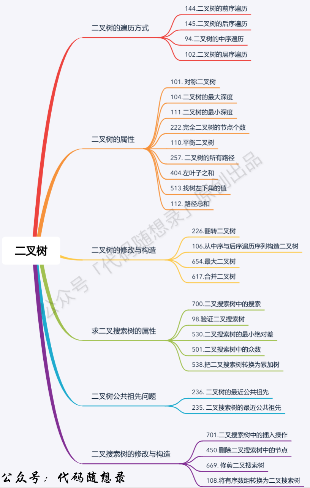

```cpp
struct TreeNode{
    // struct TreeNode defines a structure named TreeNode, which is commonly used to represent a node in a binary tree.
   int val;
   TreeNode *left;
   TreeNode *right;
   TreeNode(int x) : val(x), left(null), right(null){}
};
```
example how to create a binary tree cpp
```cpp
struct TreeNode{
    int val;
    TreeNode *left;
    Treeode *right;
    TreeNode(int x) : val(x),left(null),right(null){}
};
int main{
    // Creating individual nodes
    TreeNode *root = TreeNode(1);
    TreeNode *left = TreeNode(2);
    TreeNode *right = TreeNode(3);
    // connecting nodes to the root
    root->left = leftChild;
    root->right = rightChild;
    // Printing the tree structure
    cout << "Root value: " << root->val << endl;
    cout << "Left child value: " << root->left->val << endl;
    cout << "Right child value: " << root->right->val << endl;
    
    // Deleting nodes to free memory
    delete root;
    delete leftChild;
    delete rightChild;
    
    return 0;
}
```
py
```py
class TreeNode:
    def _init_(self,val,left = none,right = none):
        self.val = val
        self.left = left
        self.right = right
```
example how to create a binary tree python
```py
    root = TreeNode(1)
    left = TreeNode(2)
    right = TreeNode(3)

    root.left = left_child
    root.right = right_child

    printf("this is th root",root.val)
    printf("this is the left",root.left.val)
    printf("this is the right",root.right.val)
```


144. Binary Tree Preorder Traversal
Given the root of a binary tree, return the preorder traversal of its nodes' values.

Example 1:
Input: root = [1,null,2,3]
Output: [1,2,3]

Example 2:
Input: root = []
Output: []

Example 3:
Input: root = [1]
Output: [1]
preorder traversal of a binary tree
```cpp
// /**
//  * Definition for a binary tree node.
//  * struct TreeNode {
//  *     int val;
//  *     TreeNode *left;
//  *     TreeNode *right;
//  *     TreeNode() : val(0), left(nullptr), right(nullptr) {}
//  *     TreeNode(int x) : val(x), left(nullptr), right(nullptr) {}
//  *     TreeNode(int x, TreeNode *left, TreeNode *right) : val(x), left(left), right(right) {}
//  * };
//  */
// class Solution {
// public:
//     void traversal(TreeNode *cur,vector<int> &vec){
//         if(cur == nullptr){
//             return ;
//         }
//         else{
//             vec.push_back(cur->val);
//             traversal(cur->right,vec);
//             traversal(cur->left,vec);
//         }
//     }
//     vector<int> preorderTraversal(TreeNode* root) {
//         vector <int> result;
//         traversal(root,result);
//         return result;
//     }
// };
cha
class Solution {
public:
    vector<int> inorderTraversal(TreeNode* root) {
        vector<int> result;
        stack<TreeNode*> st;
        if (root != NULL) {
            st.push(root);
        }
        while (!st.empty()) {
            TreeNode *node = st.top();
            if (node != NULL) {
                st.pop();
                if (node->right) {
                    st.push(node->right);
                }
                st.push(node);
                st.push(NULL); // 用 NULL 作为标记
                if (node->left) {
                    st.push(node->left);
                }
            } else {
                st.pop(); // 弹出 NULL 标记
                node = st.top();
                st.pop();
                result.push_back(node->val); // 将节点值添加到 vec 中
            }
        }
        return result;
    }
};
```

```py
# # Definition for a binary tree node.
# # class TreeNode:
# #     def __init__(self, val=0, left=None, right=None):
# #         self.val = val
# #         self.left = left
# #         self.right = right
# class Solution:
#     def preorderTraversal(self, root: Optional[TreeNode]) -> List[int]:
#         result = list()
#         def dfs(node):
#             if node is None:
#                 return
#             else:
#                 result.append(node.val)
#                 dfs(node.left)
#                 dfs(node.right)
#                 # 其实这里的每一行都是一次dfs从头run到结尾的函数
#         dfs(root)
#         return result
class Solution:
    def preorderTraversal(self, root: Optional[TreeNode]) -> List[int]:
        result = list()
        st = list()
        if(root is None):
            return result
        else:
            st.append(root)
            while(st):
                node = st.pop()
                result.append(node.val)
                if(node.right):
                    st.append(node.right)
                if(node.left):
                    st.append(node.left)
        return result
                
```

102. Binary Tree Level Order Traversal
Given the root of a binary tree, return the level order traversal of its nodes' values. (i.e., from left to right, level by level).

Example 1:

Input: root = [3,9,20,null,null,15,7]
Output: [[3],[9,20],[15,7]]
Example 2:

Input: root = [1]
Output: [[1]]
Example 3:

Input: root = []
Output: []

```cpp
/**
 * Definition for a binary tree node.
 * struct TreeNode {
 *     int val;
 *     TreeNode *left;
 *     TreeNode *right;
 *     TreeNode() : val(0), left(nullptr), right(nullptr) {}
 *     TreeNode(int x) : val(x), left(nullptr), right(nullptr) {}
 *     TreeNode(int x, TreeNode *left, TreeNode *right) : val(x), left(left), right(right) {}
 * };
 */
class Solution {
public:
    vector<vector<int>> levelOrder(TreeNode* root) {
        queue<TreeNode*> que;
        vector<vector<int>>result;
        if(root == NULL){
            return result;
        }
        else{
            que.push(root);
            while(! que.empty()){
                vector<int>vec;
                int que_size = que.size();
                for(int i = 0;i<que_size;i++){
                    TreeNode* node = que.front();
                    que.pop();
                    vec.push_back(node->val);
                    if(node->left){
                        que.push(node->left);
                    }
                    if(node->right){
                        que.push(node->right);
                    }
                }
                result.push_back(vec);
            }
        }
        return result;
    }
};
```

```py
# Definition for a binary tree node.
# class TreeNode:
#     def __init__(self, val=0, left=None, right=None):
#         self.val = val
#         self.left = left
#         self.right = right
class Solution:
    def levelOrder(self, root: Optional[TreeNode]) -> List[List[int]]:
        queue = deque()
        result = list()
        if(root is None):
            return result
        else:
            queue.append(root)
            while(queue):
                leave = list()
                queue_size = len(queue)
                for i in range(queue_size):
                    cur = queue.popleft()
                    leave.append(cur.val)
                    if(cur.left):
                        queue.append(cur.left)
                    if(cur.right):
                        queue.append(cur.right)
                result.append(leave)
        return result
```
199. Binary Tree Right Side View
Given the root of a binary tree, imagine yourself standing on the right side of it, return the values of the nodes you can see ordered from top to bottom.

Example 1:
Input: root = [1,2,3,null,5,null,4]
Output: [1,3,4]
Example 2:

Input: root = [1,null,3]
Output: [1,3]
Example 3:

Input: root = []
Output: []

```cpp
/**
 * Definition for a binary tree node.
 * struct TreeNode {
 *     int val;
 *     TreeNode *left;
 *     TreeNode *right;
 *     TreeNode() : val(0), left(nullptr), right(nullptr) {}
 *     TreeNode(int x) : val(x), left(nullptr), right(nullptr) {}
 *     TreeNode(int x, TreeNode *left, TreeNode *right) : val(x), left(left), right(right) {}
 * };
 */
class Solution {
public:
    vector<int> rightSideView(TreeNode* root) {
        vector<int>result;
        queue<TreeNode*>que;
        if(root == NULL){
            return result;
        }
        que.push(root);
        while(!que.empty()){
            int length = que.size();
            for(int i = 0;i<length;i++){
                TreeNode* node = que.front();
                que.pop();
                if (i == (length - 1)){
                    result.push_back(node->val);
                }
                if(node->left){
                    que.push(node->left);
                }
                if(node->right){
                    que.push(node->right);
                }
            }
        }
        return result;
    }
};
```