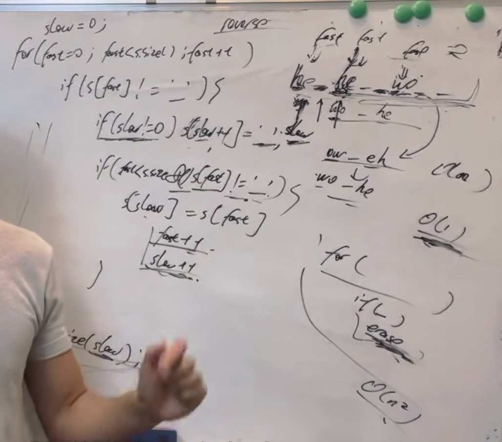

344. Reverse String
Write a function that reverses a string. The input string is given as an array of characters s.

You must do this by modifying the input array in-place with O(1) extra memory.

Example 1:

Input: s = ["h","e","l","l","o"]
Output: ["o","l","l","e","h"]
Example 2:

Input: s = ["H","a","n","n","a","h"]
Output: ["h","a","n","n","a","H"]
 
以下为代码：

class Solution {
public:
    void reverseString(vector<char>& s) {
        for(int i = 0, j = s.size() - 1;i < s.size()/2;i++,j--){
            swap(s[i],s[j]);
        }
    }
};

以下为c++的语法格式，initialization则为i = 0，而j = s.size()/2
condition则为：i<s.size()/2  边界条件最好通过举实际例子来明确
for (initialization; condition; increment) {
    // loop body
}

541. Reverse String ||
Given a string s and an integer k, reverse the first k characters for every 2k characters counting from the start of the string.

If there are fewer than k characters left, reverse all of them. If there are less than 2k but greater than or equal to k characters, then reverse the first k characters and leave the other as original.

Example 1:

Input: s = "abcdefg", k = 2
Output: "bacdfeg"
Example 2:

Input: s = "abcd", k = 2
Output: "bacd"

class Solution {
public:
    string reverseStr(string s, int k) {
        for(int i = 0;i < s.size()-1;i+=(2*k)){
            if(i+k < s.size()){
                reverse(s.begin() + i, s.begin() + i + k );
            }
            else{
                reverse(s.begin()+i,s.end());
            }
        }
    return s;
    }
};

给定一个字符串 s，它包含小写字母和数字字符，请编写一个函数，将字符串中的字母字符保持不变，而将每个数字字符替换为number。

例如，对于输入字符串 "a1b2c3"，函数应该将其转换为 "anumberbnumbercnumber"。

对于输入字符串 "a5b"，函数应该将其转换为 "anumberb"

输入：一个字符串 s,s 仅包含小写字母和数字字符。

输出：打印一个新的字符串，其中每个数字字符都被替换为了number

样例输入：a1b2c3

样例输出：anumberbnumbercnumber

数据范围：1 <= s.length < 10000。

#include <iostream>
#include <string>
using namespace std;

int main() {
    string s;
    
    while (cin >> s) {
        int count = 0;
        for (int i = 0; i < s.size(); i++) {
            if (s[i] >= '0' && s[i] <= '9') {
                count++;
            }
        }
        
        int originalSize = s.size();
        s.resize(s.size() + count * 5); // Resize the string to fit the expanded characters
        
        int newindex = s.size() - 1;
        int solidindex = originalSize - 1;

        while (solidindex >= 0) {
            if (s[solidindex] >= '0' && s[solidindex] <= '9') {
                s[newindex--] = 'r';
                s[newindex--] = 'e';
                s[newindex--] = 'b';
                s[newindex--] = 'm';
                s[newindex--] = 'u';
                s[newindex--] = 'n';
            } else {
                s[newindex--] = s[solidindex];
            }
            solidindex--;
        }
        
        cout << s << endl; 
    }
    
    return 0;
}

从前向后填充就是O(n^2)的算法了，因为每次添加元素都要将添加元素之后的所有元素整体向后移动。

其实很多数组填充类的问题，其做法都是先预先给数组扩容带填充后的大小，然后在从后向前进行操作。
优点：
1.不用申请新数组
2.从后向前填充元素，避免了从前向后填充元素时，每次添加元素都要将添加元素之后的所有元素向后移动的问题

151. Reverse Words in a String

<!-- Given an input string s, reverse the order of the words.

A word is defined as a sequence of non-space characters. The words in s will be separated by at least one space.

Return a string of the words in reverse order concatenated by a single space.

Note that s may contain leading or trailing spaces or multiple spaces between two words. The returned string should only have a single space separating the words. Do not include any extra spaces.

Example 1:

Input: s = "the_sky_is_blue"
Output: "blue_is_sky_the"
Example 2:

Input: s = "__hello_world  "
Output: "world_hello"
Explanation: Your reversed string should not contain leading or trailing spaces.
Example 3:

Input: s = "a_good___example"
Output: "example_good_a"
Explanation: You need to reduce multiple spaces between two words to a single space in the reversed string. -->

class Solution {
public:
        void reverse(string& s, int start, int end){
            for(int i = start,j = end; i<j; i++,j--){
                swap(s[i],s[j]);
            }
        }

        void removeExtraSpaces(string& s){
            int slow = 0;
            for(int fast = 0;fast<s.size();fast++){
                if(s[fast!=' ']){
                    if(s[slow]!=0){
                        s[slow++]=' ';
                    }
                    if(fast<n.size() && s[fast]!=' '){
                        s[slow++] = s[fast++];
                    }
                }
            }
            s.resize(slow);
        }   
    string reversewords(strings){
        removeExtraSpaces(s);
        reverse(s,i,j);
        int start;
        for(int i = 0;i<s.size();i++){
            if(s[i] == s.size() || s[i] == ' '){
                reverse(s,start,i-1);
                start = i + 1;
            }
        }
    }
};