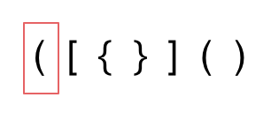
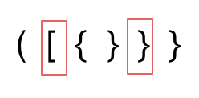
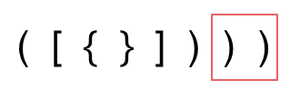

由于栈stack的结构特殊性，非常适合用来做对称类的题目，
Given a string s containing just the characters '(', ')', '{', '}', '[' and ']', determine if the input string is valid.

An input string is valid if:

Open brackets must be closed by the same type of brackets.
Open brackets must be closed in the correct order.
Every close bracket has a corresponding open bracket of the same type.
 

Example 1:

Input: s = "()"
Output: true
Example 2:

Input: s = "()[]{}"
Output: true
Example 3:

Input: s = "(]"
Output: false

一共三种情况：
第一类：字符串内左括号多余了，不匹配

第二类：括号未多余，但是不匹配

第三类：字符串右括号多余了，不匹配

以下为代码：
class solution{
public:
    bool isvalid (string s){
        if(s.size() % 2 != 0){
            return false;
        }
        stack<int>st;
        for(int i = 0;i<s.size();i++){
            if(s[i] == '(') st.push(')');
            else if (s[i] == '{' ) st.push('}');
            else if (s[i] == '[') st.push(']');
            else if (s.empty() || st.pop() != s[i]){
                return false;
            }
            else st.pop();
        }
        return st.empty();
    }
};

1047. Remove All Adjacent Duplicates In String

You are given a string s consisting of lowercase English letters. A duplicate removal consists of choosing two adjacent and equal letters and removing them.

We repeatedly make duplicate removals on s until we no longer can.

Return the final string after all such duplicate removals have been made. It can be proven that the answer is unique.

Example 1:

Input: s = "abbaca"
Output: "ca"
Explanation: 
For example, in "abbaca" we could remove "bb" since the letters are adjacent and equal, and this is the only possible move.  The result of this move is that the string is "aaca", of which only "aa" is possible, so the final string is "ca".
Example 2:

Input: s = "azxxzy"
Output: "ay"

!!!!!对于匹配元素或者消除元素类型的题目，使用栈stack是十分适合的！！！！

但是这道题目因为最后要返回未重复的string，如果使用stack最后返回的时候数值是反过来的
所以可以使用string模拟stack来完成

class solution:{
public:
    string removedulicate(S){
        string result;
        \\这句代码是定义一个string类型，名字为return的字符串
        for(char s : S)
        \\这句代码是c++风格的for loop，使用小写的s遍历大写s
        {
            if(return.empty() || return.back() != s){
                result push_back(s);
            }
            else{
                result pop_back();
            }
        }
        return result;
    }
};