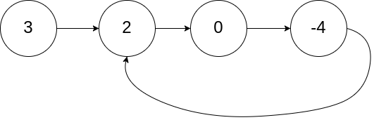
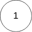

面试题 02.07. Intersection of Two Linked Lists LCCI
Given two (singly) linked lists, determine if the two lists intersect. Return the inter­ secting node. Note that the intersection is defined based on reference, not value. That is, if the kth node of the first linked list is the exact same node (by reference) as the jth node of the second linked list, then they are intersecting.

Example 1:
Input: intersectVal = 8, listA = [4,1,8,4,5], listB = [5,0,1,8,4,5], skipA = 2, skipB = 3
Output: Reference of the node with value = 8
Input Explanation: The intersected node's value is 8 (note that this must not be 0 if the two lists intersect). From the head of A, it reads as [4,1,8,4,5]. From the head of B, it reads as [5,0,1,8,4,5]. There are 2 nodes before the intersected node in A; There are 3 nodes before the intersected node in B.

Example 2:
Input: intersectVal = 2, listA = [0,9,1,2,4], listB = [3,2,4], skipA = 3, skipB = 1
Output: Reference of the node with value = 2
Input Explanation: The intersected node's value is 2 (note that this must not be 0 if the two lists intersect). From the head of A, it reads as [0,9,1,2,4]. From the head of B, it reads as [3,2,4]. There are 3 nodes before the intersected node in A; There are 1 node before the intersected node in B.

Example 3:
Input: intersectVal = 0, listA = [2,6,4], listB = [1,5], skipA = 3, skipB = 2
Output: null
Input Explanation: From the head of A, it reads as [2,6,4]. From the head of B, it reads as [1,5]. Since the two lists do not intersect, intersectVal must be 0, while skipA and skipB can be arbitrary values.
Explanation: The two lists do not intersect, so return null.
```cpp
/**
 * Definition for singly-linked list.
 * struct ListNode {
 *     int val;
 *     ListNode *next;
 *     ListNode(int x) : val(x), next(NULL) {}
 * };
 */
class Solution {
public:
    ListNode *getIntersectionNode(ListNode *headA, ListNode *headB) {
        ListNode *curA = headA;
        ListNode *curB = headB;
        int lenA = 0;
        int lenB = 0;
        while(curA != NULL){
            curA = curA->next;
            lenA ++;
        }
        while(curB != NULL){
            curB = curB->next;
            lenB ++;
        }
        curA = headA;
        curB = headB;
        if(lenB > lenA){
            swap(curA,curB);
            swap(lenA,lenB);
        }
        int gap = lenA - lenB;
        while(gap--){
            curA = curA->next;
        }
        while (curA != NULL) {
            if (curA == curB) {
                return curA;
            }
            curA = curA->next;
            curB = curB->next;
        }
        // if(curA == curB){
        //     return curA;
        // }
        // else{
        //     curA = curA->next;
        //     curB = curB->next;
        // }
        // 需要不断的比较，如果无while loop则只有一次

        return NULL;
    }
};
```
```py
# Definition for singly-linked list.
# class ListNode:
#     def __init__(self, x):
#         self.val = x
#         self.next = None

class Solution:
    def getIntersectionNode(self, headA: ListNode, headB: ListNode) -> ListNode:
        curA = headA
        curB = headB
        lenA = 0
        lenB = 0
        while curA :
            curA = curA.next
            lenA += 1
        while curB :
            curB = curB.next
            lenB += 1
        curA = headA
        curB = headB
        if (lenB > lenA):
            curA, curB = curB, curA
            lenA, lenB = lenB, lenA
        # gap = lenA - lenB
        for i in range(lenA-lenB):
            curA = curA.next
        while curA :
            if (curA==curB):
                return curA
            curA = curA.next
            curB = curB.next
        return None     
```
142. Linked List Cycle II
Given the head of a linked list, return the node where the cycle begins. If there is no cycle, return null.

There is a cycle in a linked list if there is some node in the list that can be reached again by continuously following the next pointer. Internally, pos is used to denote the index of the node that tail's next pointer is connected to (0-indexed). It is -1 if there is no cycle. Note that pos is not passed as a parameter.

Do not modify the linked list.
Example 1:

Input: head = [3,2,0,-4], pos = 1
Output: tail connects to node index 1
Explanation: There is a cycle in the linked list, where tail connects to the second node.

Example 2:

Input: head = [1,2], pos = 0
Output: tail connects to node index 0
Explanation: There is a cycle in the linked list, where tail connects to the first node.

Example 3:

Input: head = [1], pos = -1
Output: no cycle
Explanation: There is no cycle in the linked list.

```cpp
/**
 * Definition for singly-linked list.
 * struct ListNode {
 *     int val;
 *     ListNode *next;
 *     ListNode(int x) : val(x), next(NULL) {}
 * };
 */
class Solution {
public:
    ListNode *detectCycle(ListNode *head) {
        ListNode *fast = head;
        ListNode *slow = head;
        while(fast != NULL and fast->next != NULL){
            fast = fast->next->next;
            slow = slow->next;
            if(fast == slow){
                ListNode *index1 = head;
                ListNode *index2 = fast;
                while(index1 != index2){
                    index1 = index1->next;
                    index2 = index2->next;
                }
                return index1;
            }
        }
        return NULL;
    }
};
```

```py
# Definition for singly-linked list.
# class ListNode:
#     def __init__(self, x):
#         self.val = x
#         self.next = None

class Solution:
    def detectCycle(self, head: Optional[ListNode]) -> Optional[ListNode]:
        fast = head
        slow = head
        while(fast != None and fast.next != None):
            fast = fast.next.next
            slow = slow.next
            if(fast == slow):
                index1 = head
                index2 = fast
                while(index1 != index2):
                    index1 = index1.next
                    index2 = index2.next
                return index1
        return None
        
```