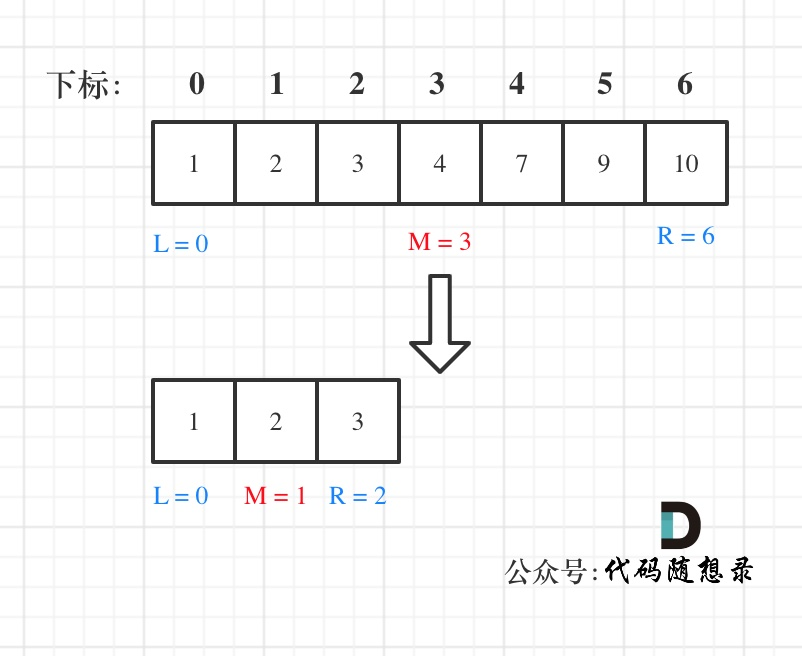
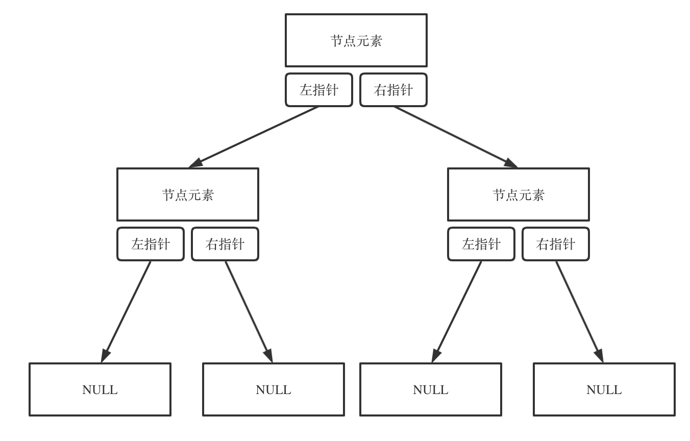

代码随想录算法训练营第一天| 704. 二分查找、27. 移除元素

leetcode207二分查找

第一种写法，定义 target 是在一个在左闭右闭的区间里，也就是[left, right] 

区间的定义这就决定了二分法的代码应该如何写，因为定义target在[left, right]区间，所以有如下两点：

while (left <= right) 要使用 <= ，因为left == right是有意义的，所以使用 <=
可以是[1，1]来举例说明，因为左边和右边都包含1，所以可能left = right，即1=1
if (nums[middle] > target) right 要赋值为 middle - 1，因为当前这个nums[middle]一定不是target，
！！！要一直坚持左闭右闭的原则，以为已经确定nums[middle]是大于target，那么就应该选择下一位（middle-1）
那么接下来要查找的左区间结束下标位置就是 middle - 1
例如在数组：1,2,3,4,7,9,10中查找元素2，如图所示：

class solution{
public:
    int search(vector<int>& nums, int target){
        int left = 0;
        int right = num.size() - 1;
        while(left<=right){
            int middle = left + ((right - left) / 2);
            if(nums[middle] > target){
                right = middle - 1;
            }
            else if(num[middle] < target){
                left = middle + 1;
            }
            else{
<!-- (num[middle] = target); -->
            return middle;
            }
        return 0;
    }
};

#二分法第二种写法
如果说定义 target 是在一个在左闭右开的区间里，也就是[left, right) ，那么二分法的边界处理方式则截然不同。
有如下两点：

while (left < right)，这里使用 < ,因为left == right在区间[left, right)是没有意义的
依然可以是[1，1)来举例说明，因为左边已经包含1，但是右边不包含1，所以不可能left = right
if (nums[middle] > target) right 更新为 middle，因为当前nums[middle]不等于target，去左区间继续寻找，而寻找区间是左闭右开区间，所以right更新为middle，即：下一个查询区间不会去比较nums[middle]
在数组：1,2,3,4,7,9,10中查找元素2，如图所示：（注意和方法一的区别）

class solution{
public:
    int search(vector<int>& nums, int target){
        int left;
        int right = nums.size() - 1;
        while(left < right){
            int middle = left + ((right - left)+1);
            if(nums[middle] > target){
                right = middle
            }
            else if(nums[middle] < target){
                left = middle - 1;
            }
            else{
                return middle;
            }
        return 0;
        }
    }
}

移除元素：
给你一个数组 nums 和一个值 val，你需要 原地 移除所有数值等于 val 的元素，并返回移除后数组的新长度。

不要使用额外的数组空间，你必须仅使用 O(1) 额外空间并原地修改输入数组。

元素的顺序可以改变。你不需要考虑数组中超出新长度后面的元素。

示例 1: 给定 nums = [3,2,2,3], val = 3, 函数应该返回新的长度 2, 并且 nums 中的前两个元素均为 2。 你不需要考虑数组中超出新长度后面的元素。

示例 2: 给定 nums = [0,1,2,2,3,0,4,2], val = 2, 函数应该返回新的长度 5, 并且 nums 中的前五个元素为 0, 1, 3, 0, 4。

你不需要考虑数组中超出新长度后面的元素。

第一种方法：暴力解法
// 时间复杂度：O(n^2)
// 空间复杂度：O(1)
class Solution {
public:
    int removeElement(vector<int>& nums, int val) {
        int size = nums.size();
        for (int i = 0; i < size; i++) {
            if (nums[i] == val) { // 发现需要移除的元素，就将数组集体向前移动一位
                for (int j = i + 1; j < size; j++) {
                    nums[j - 1] = nums[j];
                }
                i--; // 因为下标i以后的数值都向前移动了一位，所以i也向前移动一位
                size--; // 此时数组的大小-1
            }
        }
        return size;

    }
};

第二种方法：双指针
双指针法（快慢指针法）： 通过一个快指针和慢指针在一个for循环下完成两个for循环的工作。

定义快慢指针

快指针：寻找新数组的元素 ，新数组就是不含有目标元素的数组
慢指针：指向更新 新数组下标的位置

// 时间复杂度：O(n)
// 空间复杂度：O(1)
class Solution {
public:
    int removeElement(vector<int>& nums, int val) {
        int slowIndex = 0;
        for (int fastIndex = 0; fastIndex < nums.size(); fastIndex++) {
            if (val != nums[fastIndex]) {
                nums[slowIndex++] = nums[fastIndex];
            }
        }
        return slowIndex;
    }
};
