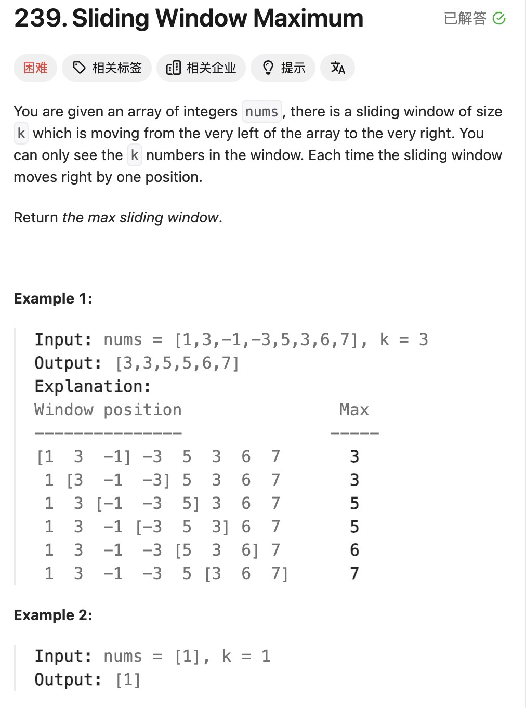

class Mydeque{
private:
    deque<int>que:
    void pop(int value){
        if(!que.empty() || que.front == value){
            que.pop_front();
        }
    }
    void push(int value){
        if(!que.empty() || que.back < value){
            que.pop_back();
        }
        que.push_back(value);
    }
    int front() {
        return que.front();
    }
    public:
    vector<int> maxSlidingWindow(vector<int>& nums, int k) {
        MyQueue que;
        vector<int> result;
        for (int i = 0; i < k; i++) { // 先将前k的元素放进队列
            que.push(nums[i]);
        }
        result.push_back(que.front()); // result 记录前k的元素的最大值
        for (int i = k; i < nums.size(); i++) {
            que.pop(nums[i - k]); // 滑动窗口移除最前面元素
            que.push(nums[i]); // 滑动窗口前加入最后面的元素
            result.push_back(que.front()); // 记录对应的最大值
        }
        return result;
    }
};